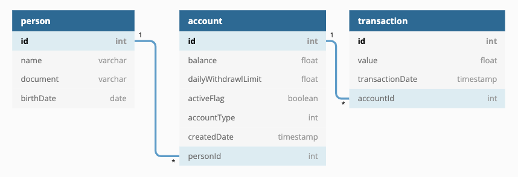

# Account-Manager-System

## The Challenge 

> Develop the REST API resources that perform banking transactions.

### Minimum Scope

- [x] Implement path that performs the creation of an account.
- [x] Implement path that performs deposit operation on an account.
- [x] Implement path that performs balance inquiry operation on a given account.
- [ ] Implement path that performs withdrawal operation on an account.
- [ ] Implement path that performs the blocking of an account.
- [ ] Implement path that retrieves the account statement of transactions.

### What Will Be Differential & Evaluated

- Implement statement by period.
- Develop execution manual.
- Prepare documentation.
- Develop tests.
- Implementation of points of failure and resilience.
- Elaborate design of the project architecture.

---
## Entity-Relationship Diagram of SQL DataBase

 

---
## Endpoints

### [POST - "/account/create"] : Create an account and person/client.

- **Expect:** {person.name, person.document, person.birthDate, account.dailyWithdrawlLimit, account.accountType}.
- **Return:** *Message: 'Person and Account successfully created'.* 

### [POST - "/account/:id/deposit"] : Create a deposit.

- **Expect:** *params and { transaction.value }.*
- **Return:** *Message: '${transaction.value} was deposited successfully'.*
  

### [GET - "/account/:id/balance"] : Create a deposit.

- **Expect:** *params*
- **Return:** *{ "balance": number}*
